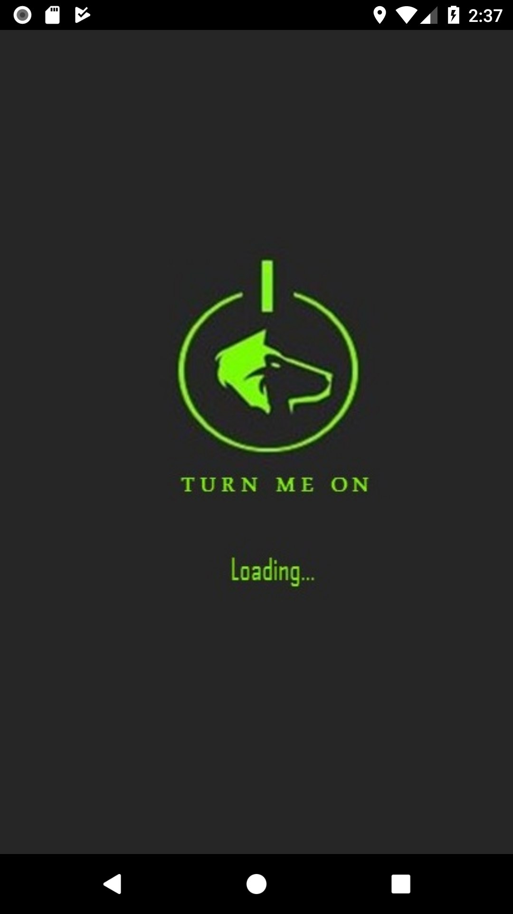
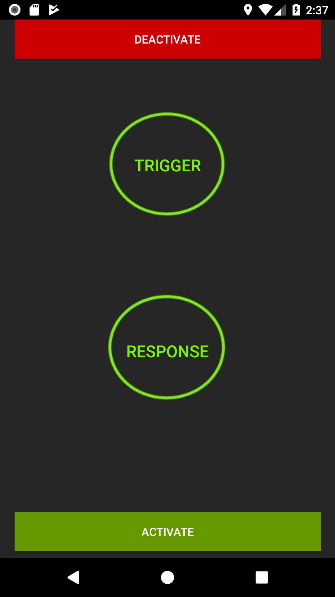
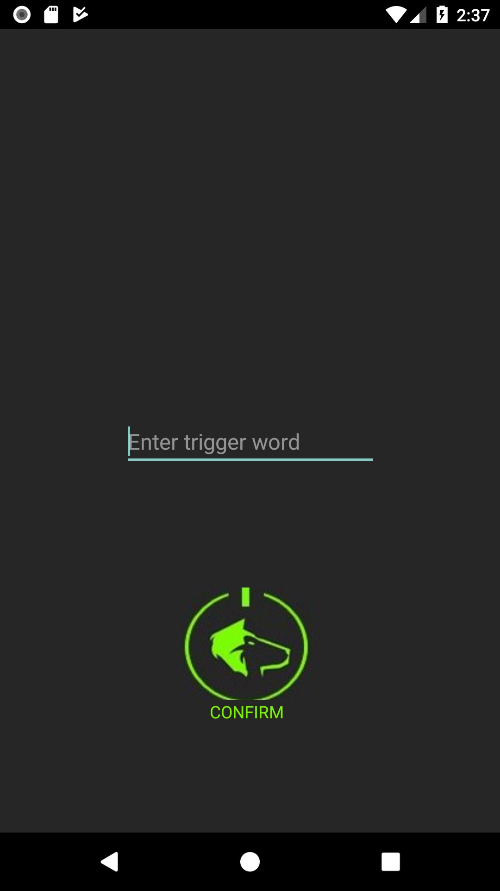
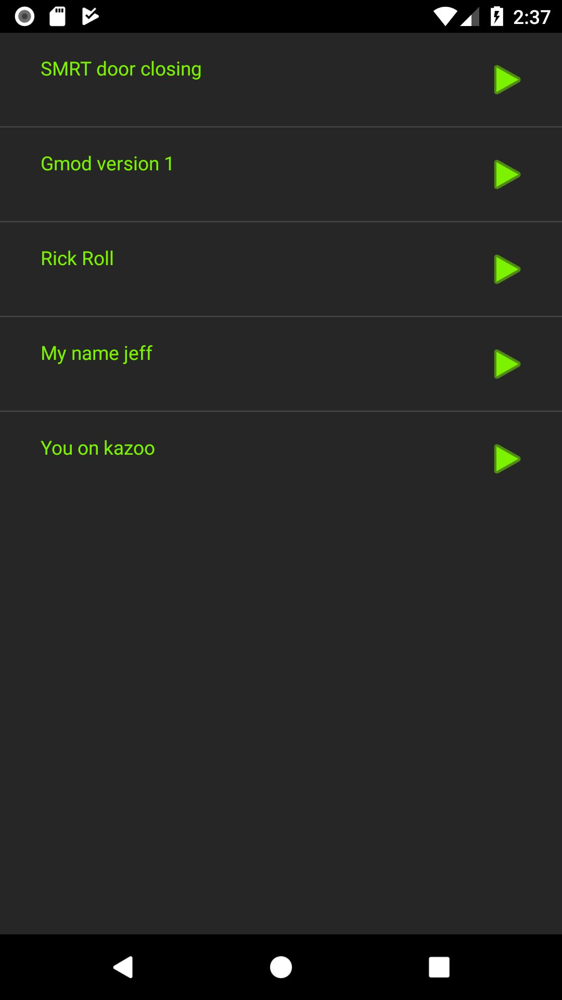

# TurnMeOn
Never lose your phone again. Ever.

## Story
If you habitually misplace your phone, or specifically, an android phone, just download Turn Me On.
Turn Me On uses voice recognition to identify your personal trigger word and responds with an alarm
for you to locate your phone. Upon starting up Turn Me On for the first time, you will be required
to specify a trigger word and select your response alarm from the default list. Then select the
activate button and never lose your phone again. In the event that you lose your phone, just call
out your trigger word and follow the sound of the alarm which will lead you to your misplaced phone.

## Key Features
- Speech recognition
- Customizable trigger word

## Built With
`java` `android-studio`

## Acknowledgements
Libraries used: [Pocketsphinx](https://github.com/cmusphinx/pocketsphinx-android-demo)

## Screen shots
   
